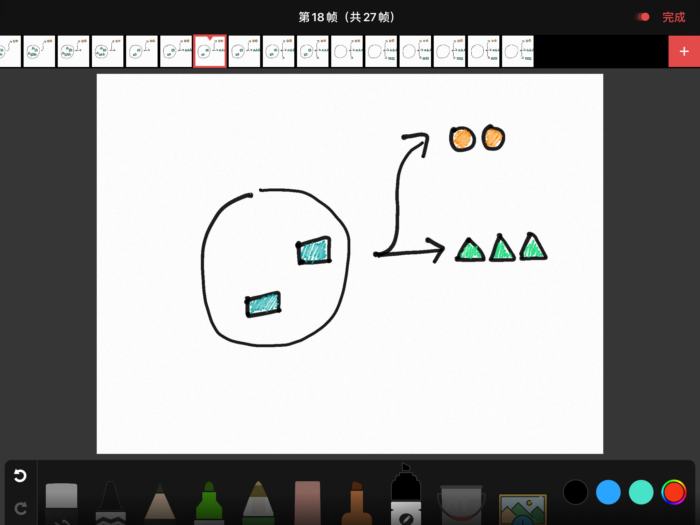
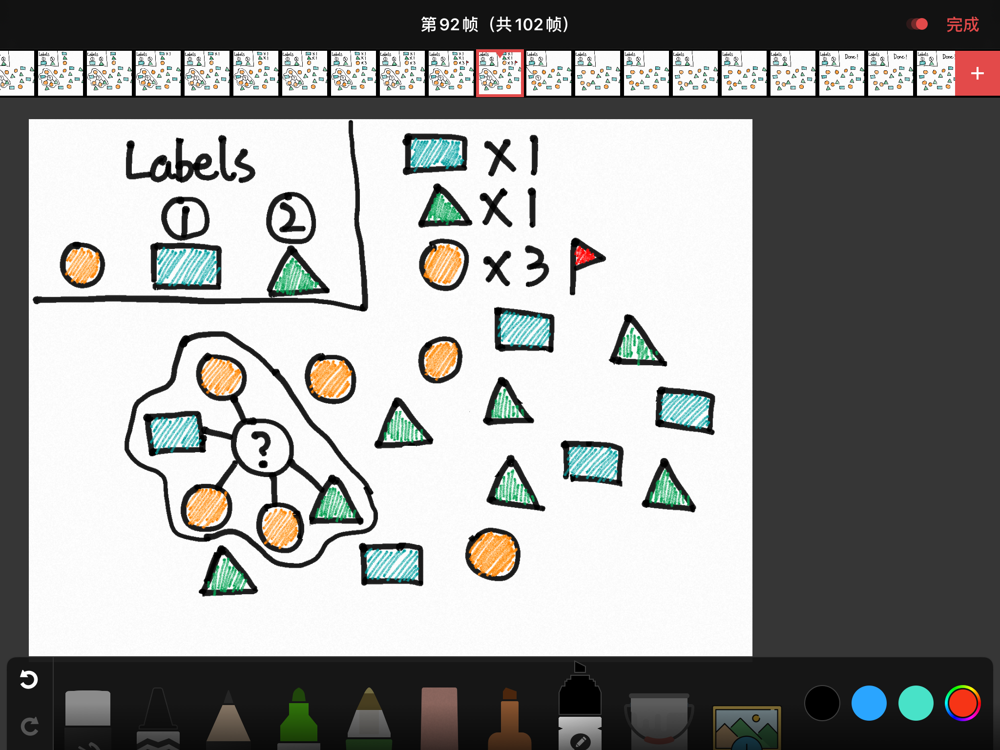
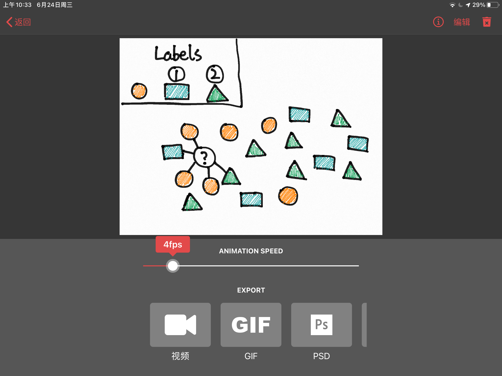
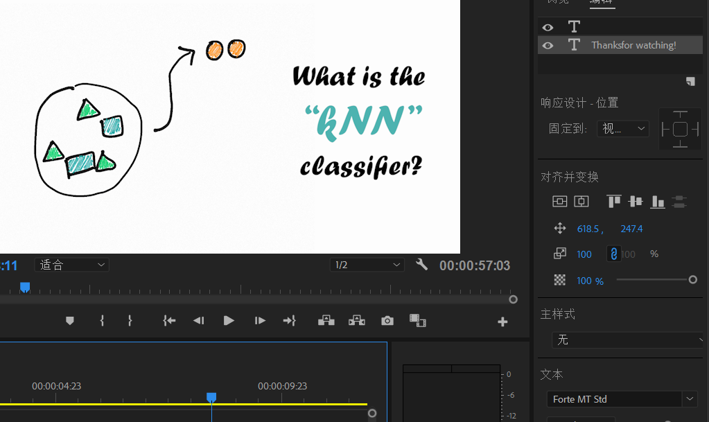
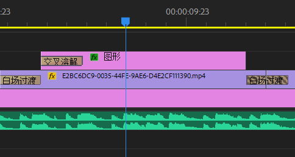
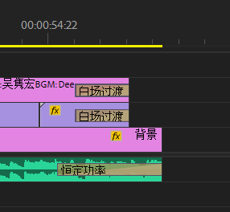
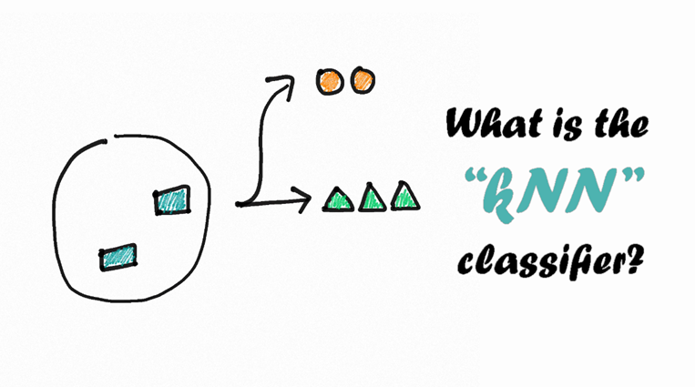
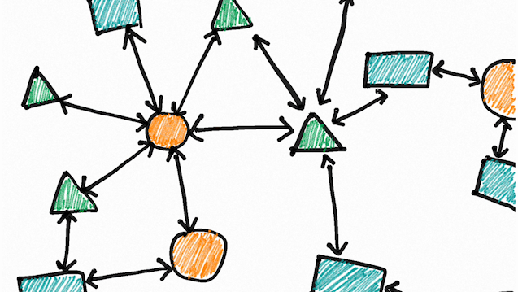
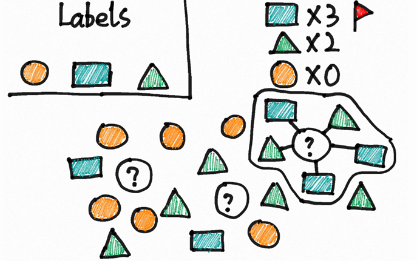

# 手绘kNN算法动画

## 🎈项目主题

使用手绘动画的方式演示kNN算法的思想和运行

 

## 🛠制作工具

+ Animatic（ios端）
+ Adobe Premiere Pro CC 2018.1
+ 作品运行环境：任一MP4播放器

 

## 📄制作流程

### 分镜

+ 引入
  + 提出问题
+ 封面
  + 展示“分类”问题
  + 展示视频title
+ “距离”属性解释
  + 在kNN中，距离表示对象之间的相似性
  + 动画解释，用箭头表示对象之间的距离
+ 过渡：“start”字样
+ 实例演示
  + k=5，给出三个待分类对象，动画演示分类的过程
+ 结束

### 绘制

1. 对于每个分镜场景，在Animatic（ios端）软件中创建帧动画
   
2. 逐帧绘制
   
3. 着色
4. 设置播放速度为4帧/秒，将每个分镜场景导出为mp4媒体，用于下一步剪辑
   

### 剪辑

1. 将上一步导出的所有动画片段和配乐导入到Premiere Pro软件
2. 创建16:9，24fps的序列
3. 将动画片段按照分镜顺序添加到轨道，调整动画在画布上的布局（大小与位置）
4. 添加颜色遮罩作为背景，底色与动画的背景色相同
5. 添加必要的文字（一部分文字通过手绘的方式包含在动画中，不需要后期再添加）
   + 调整文字的样式（字体与配色），字体选用了偏向手绘风的Forte MT std，配色与动画所用配色统一
     
6. 添加视频过渡效果
   + 画面过渡使用白场过渡，文字过渡选用交叉溶解
   + 调整过渡效果的持续时间以获得更自然的观感
     
7. 添加配乐
   + 配乐使用Deep East Music - Sunny Jim
   + 添加音频过渡效果，在视频结束时恒定功率衰减
     

### 发布

+ 导出媒体，选择H.264编码格式

 

## 🎨作品风格展示

+ 封面
  

+ kNN中的“距离”
  

+ 实例演示
  

